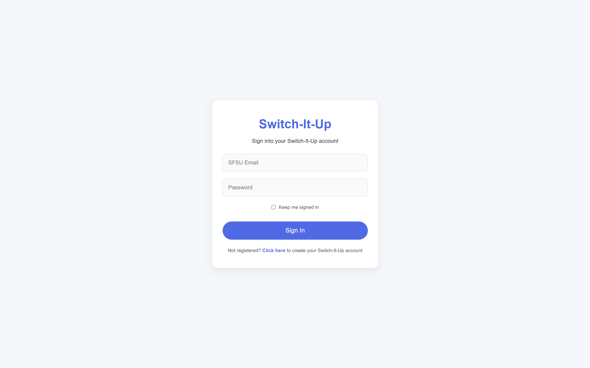
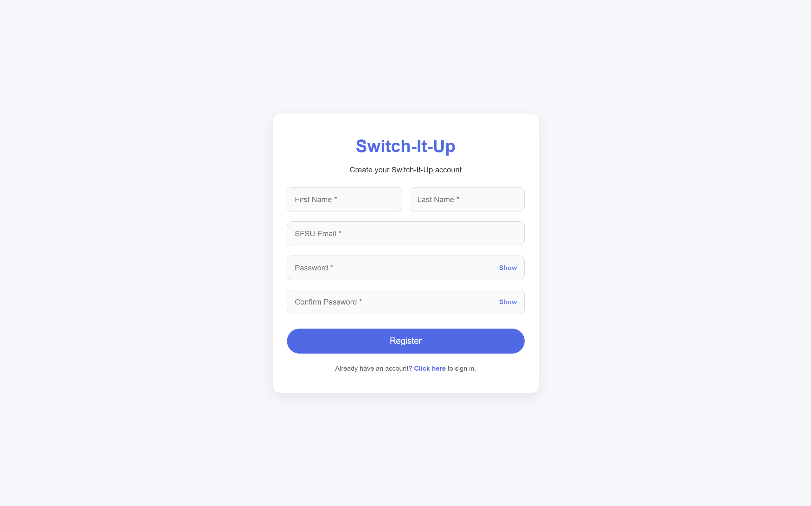
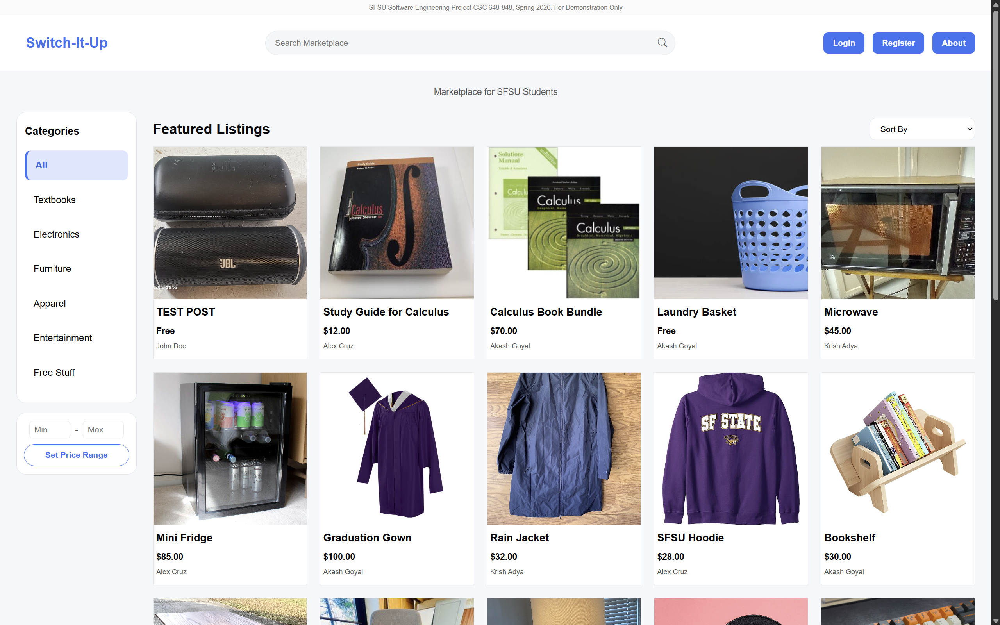
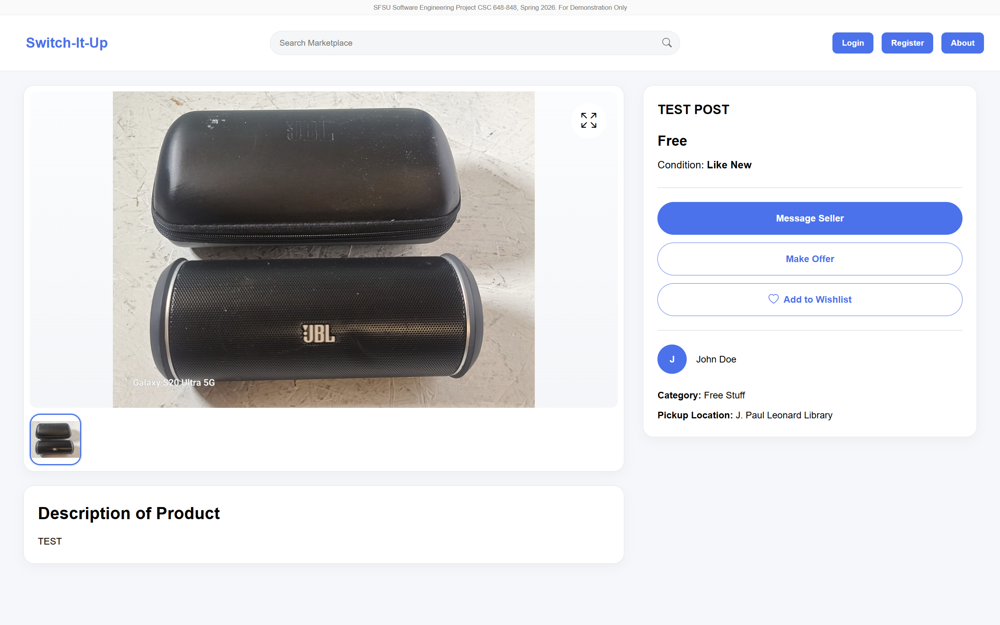
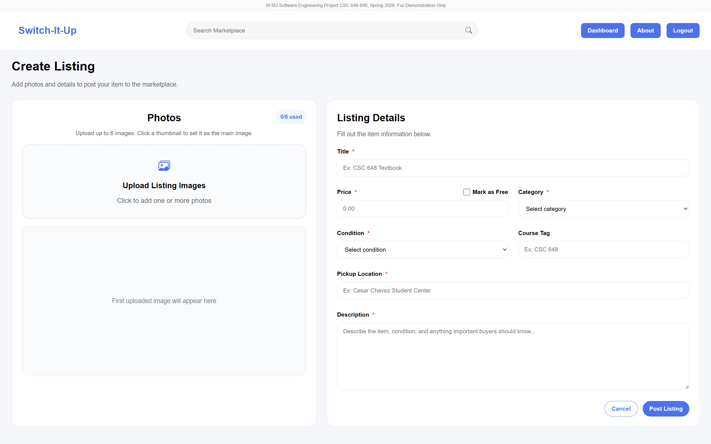
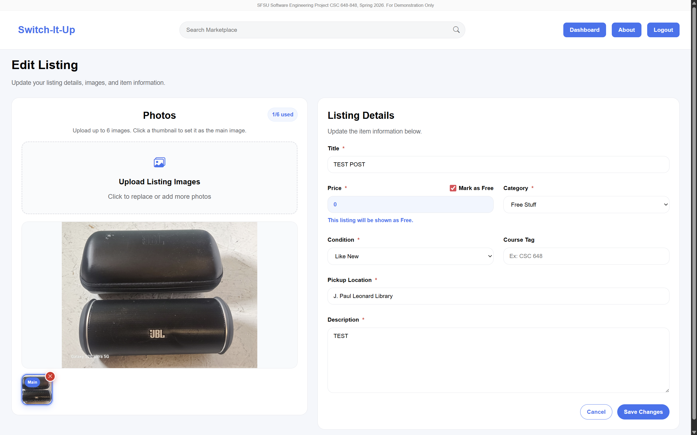
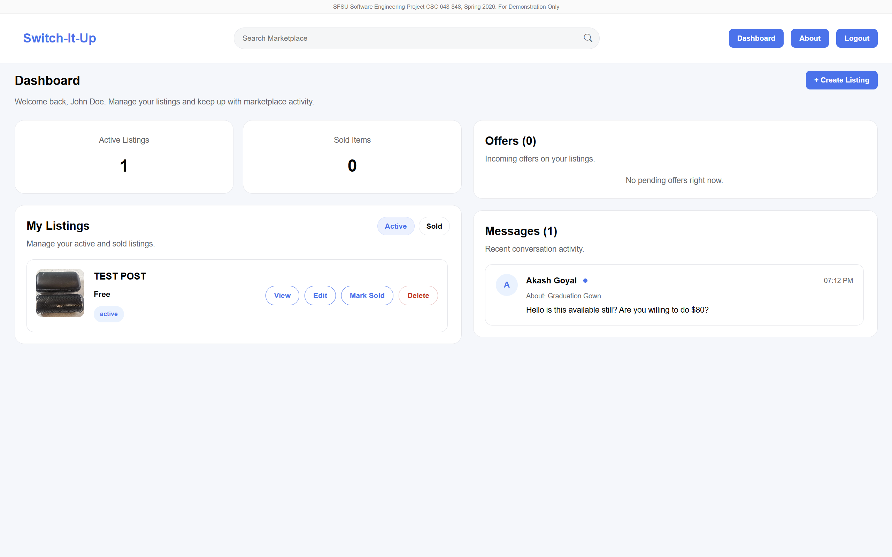
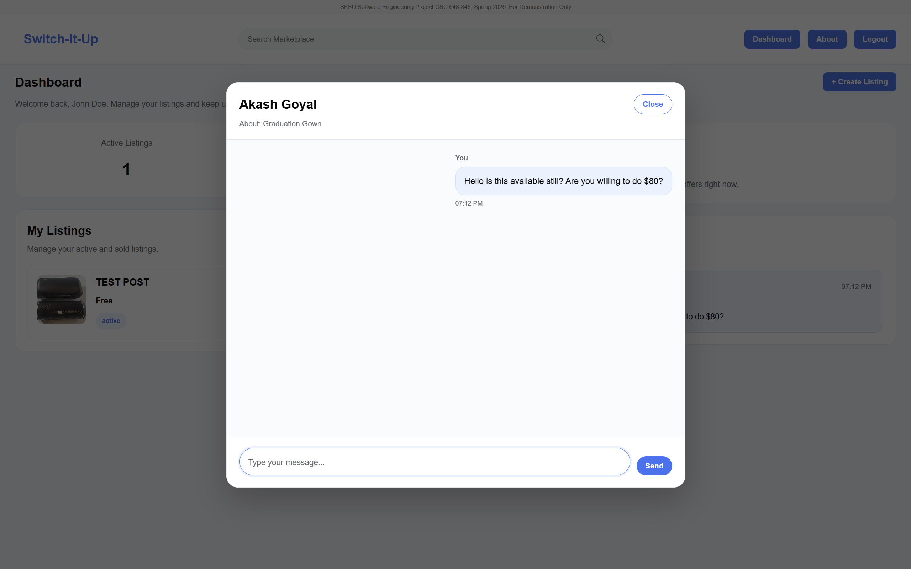
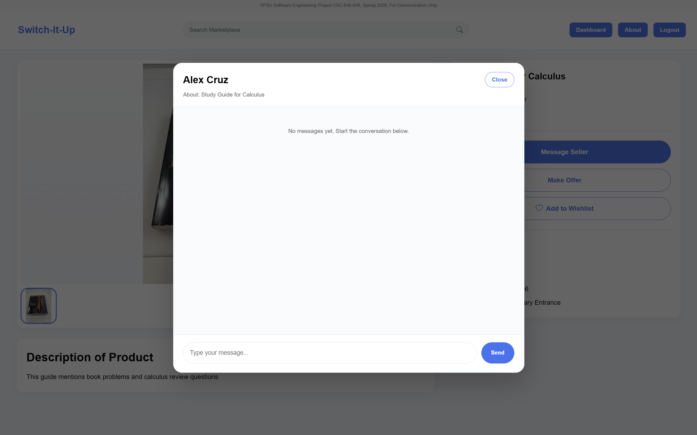

# SFSU Marketplace

A full-stack marketplace web application built for San Francisco State University students to buy, sell, and communicate about items within the campus community. The platform provides secure account management, listing creation, image uploads, search and filtering capabilities, and an integrated messaging system for buyers and sellers.

## Features

- User registration and authentication
- Create, edit, and delete marketplace listings
- Multiple image uploads per listing
- Search and filter listings by category and keywords
- Buyer and seller messaging system
- User dashboard for managing active and sold listings
- Protected routes and account-specific functionality
- Responsive design for desktop and mobile devices

## Technologies

### Frontend
- React
- JavaScript
- HTML5
- CSS3

### Backend
- Node.js
- Express

### Database
- MySQL

### Infrastructure & Deployment
- AWS EC2
- Nginx
- PM2

## My Contributions

As Team Lead and one of the primary developers on an 8-person senior capstone team, my contributions included:

- AWS EC2 deployment and server configuration
- Nginx and PM2 production setup
- Protected route implementation
- Dashboard functionality and management pages
- Create, edit, and delete listing features
- Messaging system user interface
- Multiple image upload functionality
- Listing status management (pending, active, and sold)
- Search and filtering improvements
- Frontend page development and UI enhancements
- Application testing, deployment, and maintenance
- Task management, milestone reviews, and team coordination

## Screenshots

### Authentication

#### Login

#### Registration

### Marketplace

#### Home Page

#### Item Details

### Listing Management

#### Create Listing

#### Edit Listing

#### Dashboard

### Messaging

#### Messaging Interface

#### Contact Seller

## Project Status

This project was developed as a senior capstone project at San Francisco State University and demonstrates full-stack web development, cloud deployment, database management, and collaborative software engineering practices.